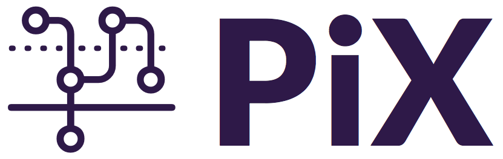

## PiX: Interaction notation for UX design

PiX is a visual language specially crafted to define and model user experience within digital services. PIX Language based upon service blueprinting and customer journeys, among other visual languages. It is being continuously developed at Taller de Investigaciones Gráficas .:TIG:. [Escuela de Arquitectura y Diseño](http://www.ead.pucv.cl).

**Online tool available &rarr; [here](http://eadpucv.github.io/pix)**

Artistic License 2.0

